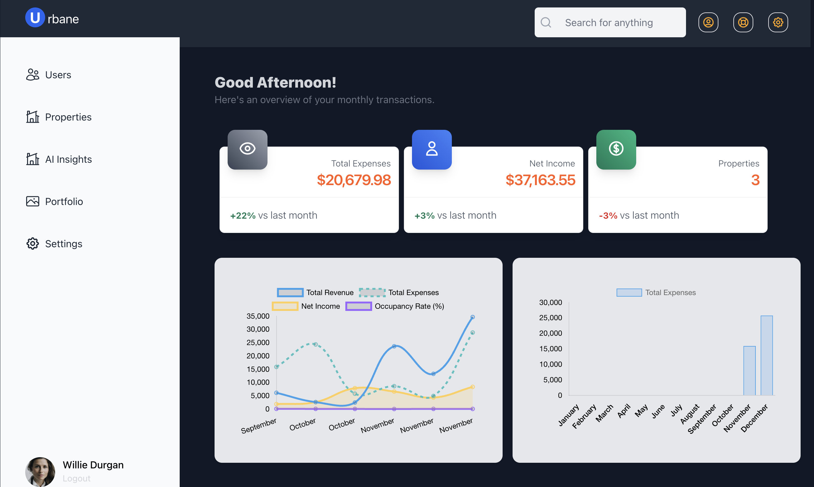

# OVERVIEW
Real estate platform for investors, landlords, and tenants to manage properties, track financial performance, and receive AI-driven insights. Helps Manage tasks and portfolios and uses Eliza framework for advanced AI-powered market analysis and conversational insights.


# INSTALLATION
This project uses `pnpm` as package manager and uses node v23.3.0 so you need to have that installed before cloning the app.

### Configurations
- Install dependendies by runing `pnpm install` on the root directory
- If you get an error try running it with `--ignore-script` flag.
- Run `pnpm prisma generate` to setup you prima models and client
- Create your tables `npx prisma migrate dev --name init`
- Seed some dummy data by running `pnpm db:seed`
- Run `pnpm dev` this will start the frontend and the backend concurrently 

### backend/.env
```bash
DATABASE_URL="your postgres connection url"
JWT_SECRET='define your scerete here'
OPENAI_API_KEY="your api token here"
OPENAI_URL="https://api.openai.com/v1"
BASE_URL="http://localhost:3000"
AGENT_ID="a42e674c-e175-02e3-9724-5805575cd944"
PORT=3000
```

### frontend/.env
```bash
APP_URL="http://localhost:3001"
API_BASE_URL="http://localhost:3000/api"
NEXTAUTH_SECRET='define a secrete here'
NEXTAUTH_URL=http://localhost:3001
AGENT_ID='b850bc30-45f8-0041-a00a-83df46d8555d'
```

## Core Features
Completed (✅) | In progress (🔄) | Not done (❌)

#### 1. **User Authentication and Role Management**
- **Roles**: Investors, landlords, tenants, and administrators. ✅
- Secure login using JWT with optional Multi-Factor Authentication (MFA). ✅
- Role-based permissions for accessing specific features (e.g., property management for landlords, viewing shared portfolios for tenants). 🔄

#### 2. **Property Management**
- Add and manage properties with details (e.g., location, type, purchase price, current value). ✅
- Track property-related expenses, rental income, and maintenance logs. ✅
- Generate automated performance reports for individual properties and entire portfolios. 🔄

#### 3. **Shared Portfolio Collaboration**
- Create shared property portfolios for group investments (e.g., family or business partnerships). ✅
- Assign roles within a portfolio (e.g., manager, contributor). ✅
- Real-time updates on shared tasks and financial contributions. 🔄

#### 4. **AI Market Insights**
- Use the **Eliza Framework** to:
  - Analyze local real estate trends (e.g., property appreciation rates, rental demand). ✅
  - Provide personalized property recommendations based on user goals. ✅
  - Offer portfolio optimization advice (e.g., properties to buy, hold, sell). ✅

#### 5. **Task and Workflow Management** ❌
- Integrate **Sharktower UI React** to provide:
  - Kanban boards for tracking property tasks (e.g., repairs, lease renewals).
  - Timelines for major events (e.g., maintenance schedules, rental due dates).
  - Interactive dashboards for managing tasks across portfolios.

#### 6. **Tailwind CSS Styling**
- User-friendly interfaces with **Tailwind CSS**. ✅
  - Property cards with collapsible details. ✅
  - Financial performance graphs styled for dark and light modes. 🔄
  - Mobile-first layouts for seamless usage on any device. ✅

#### 7. **Notifications and Alerts** 🔄
- Notify users via email or push notifications for:
  - Task deadlines (e.g., maintenance, lease expiration).
  - Significant portfolio updates (e.g., property value changes).
  - AI-generated recommendations and market insights.

#### 8. **Integration with External APIs** 🔄
- **Real estate listing APIs** (e.g., Zillow, Realtor.com) for live property data.
- **Financial APIs** for mortgage rates, loan calculators, and ROI analysis.
- **Demographics APIs** for neighborhood insights (e.g., crime rates, school ratings).

### NOTE:
Most of the completed tasks are on the backend and the frontend has not been fully integrated with the apis.  To view the api documentation visit: `http://localhost:3000/api-docs`

### TODOS
- Add job schedular to generate reports and notify users
- Implement Qeueing for report generation and notification
- Implement Web socket for real-time communication between backend and frontend
- Add data polling system to collect data from external apis
- Run the polling periodically, lets say every day or hour
- Add Custom providers and actions that will interact directly with the database, give more dynamic response and acurate data
- Add role permission restrictions to both frontend and backend.
- Add images to properties
- Determine actions each roles can perform in a portfolio
- List propperties and allow users to buy, rent and checkout successfully with real-time notification


